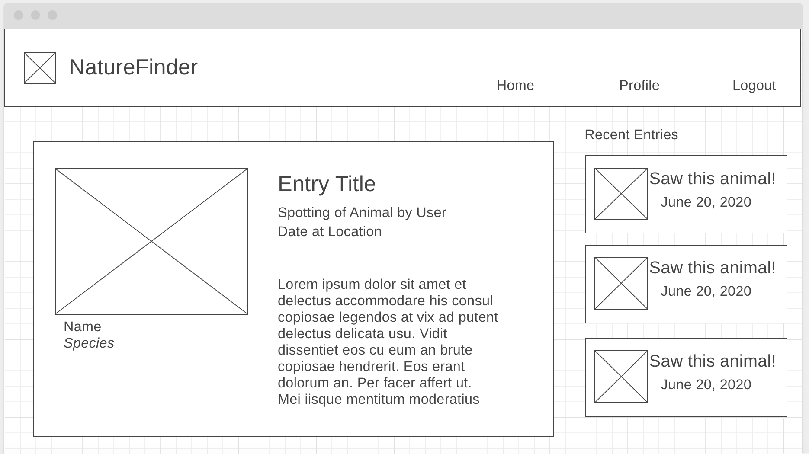

# Nature Finder

Web application using API calls

## 1. Project Planning

**MVP** 

As a basic MVP, it was decided from the information able to be pulled from the API that a basic user interaction would have these steps:

1. *Search by zipcode or location.* This would then be translated into a latitude and longitude range.
2. *Show animals in that location.* The GBIF API would be called using the range from the previous step, and resulting occurences would need to be mapped into an array of unique animals based on species.
3. *Click on an animal to view its information.* For the animal clicked upon by the user, a species call would be made to the GBIF API using the unique species key for that animal. Next, another occurence call would be made to list recent occurences of that animal. The user would be able to see the number of occurences over the past year, with the peak month highlighted.
4. *Allow the user to save the animal for later.* If the user is logged in, there would be an option on the page for the user to save the animal as a favorite. Its information would then be stored in a database and retrieved when they view their profile page. 

#### Finding APIs

The ideas for the project began with finding APIs to use. This project initially uses 2:

* **GBIF (Global Biodiversity Information Facility)** -  API and database for wildlife occurences. 
[Website](https://www.gbif.org/developer/summary)

* **Mapbox** - API for time series forecasting. [Website](https://docs.mapbox.com/api/search/)

The idea was to create an app that shows animals in a particular area and show past data over . Users can use this information to determine when is a best time to see a particular animal in that area. 

#### API Calls

To ensure that the pertinent information could be pulled from the api, several sample calls were made. It was found that the GBIF could search for occurences based on a logitude and latitude range. Since the intention was for a user to input a zipcode or location name in the search function, another API would need to be used to change that location into a latitude and longitude range. [Mapbox](https://docs.mapbox.com/api/search/) has forward geocoding API which would be used to translate a place name into a latitude and longitude. A range would be tacked onto this before calling the GBIF API. Finally, a species call would be made to the GBIF API to get information about a particular species.

#### Database

Two tables were planned for the database: users and animals. These two tables would have a many to many (M:M) relationship, with many animals having many users. The database was a PostGreSQL database populated using the node module Sequelize.

**Table: Users**

* email: string
* name: string
* password: string
* img: string

The password was limited between 8 and 99 characters, name between 1 and 99 characters, and the email could not be null. Node modules passport and bcrypt were used to encrypt the passwords and support user authentication.

**Table: Animals**

* speciesKey: integer
* name: string
* lat: numeric
* long: numeric
* location: string
* img: string

The animals table stored the species key, which was the GBIF species key to be used to call the API for that species. The location was stored, but to make it easier to call the location in the Mapbox API, the latitude and longitude were also stored. Finally, an image of the animal was stored; if there was no image available, instead a placeholder image was used.

**Table: UsersAnimals**

* UserID: integer
* AnimalID: integer

#### Routing

The following routes were developed for a RESTful routing system in Express with full CRUD capabilities.

_**GET**_
**/** - show the homepage
**/auth/signup** - show a form to make a new account
**/auth/login** - show a form to log in
**/auth/logout** - log the user out and redirect to home
**/profile** - show a user's profile
**/profile/edit** - show a form to edit a user's profile
**/results** - show either a list of locations or the animal results for a single location
**/results/:id** - show a single animal

Authorization was utilized so that only relevant get routes could be accessed if a user is logged in. The profile page called on the DB to get information about a user and their favorited animals. The results pages were the most complicated, making multiple calls to the APIs. 

_**POST**_
**/auth/signup** - create a user in the db
**/auth/login** - use passport to authenticate the user
**/profile/favorites** - add a new animal to the db

_**PUT**_
**/profile/edit** - update a user's profile in the db

_**DELETE**_
**/profile/:key** - delete an animal from the user's favorites by removing the relation in the usersAnimals relational table.

#### Technologies Used

**APIs** GBIF, Mapbox
**Node Modules** Mapbox-sdk, Axios, BCrypt, connect-flash, .env, EJS, Express, Express EJS Layouts, Express Sessions, Helmet, Method Override, Morgan, Nodemon, Passport, Sequelize.

#### User Flow and Wireframes

*Initial User Flow Diagram*

A user flow was mocked up to determine how a new or past user would navigate the sight. Then, several wireframes were developed to determine the layout of some of the more complex webpages, such as the home page. Next, UX students were consulted to critique the user flow and wireframes. Because of this, the link to "Home" at the top was removed, and the logo was made more prominent.

*Wireframe for Homepage*

*Wireframe for a user profile*

*Wireframe to show an animal*

*Wireframe to show a user's journal entry*

